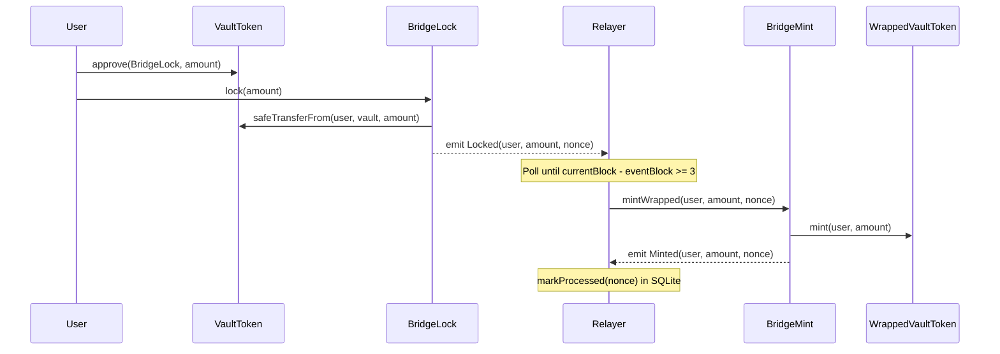
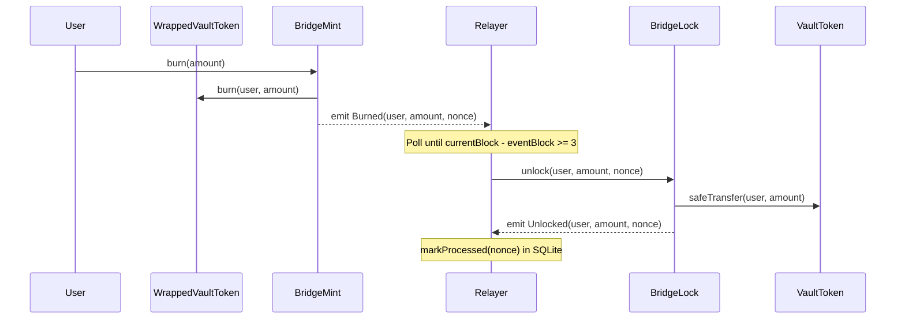
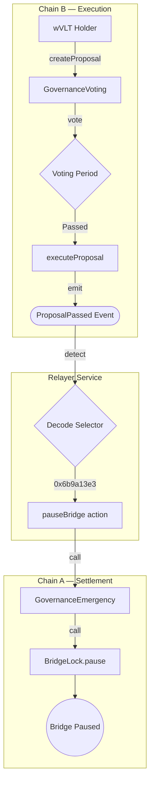

# Architecture: Omnichain Asset Bridge

This document details the design patterns, event flows, security model, and technical decisions behind the bridge system.

---

## System Overview

The bridge connects two independent EVM chains using an off-chain relayer as the message transport layer. There is no direct on-chain communication between Chain A and Chain B. Instead, the relayer observes events on one chain and submits corresponding transactions on the other.

```
┌─────────────────────┐         ┌─────────────────────┐
│   Chain A (1111)    │         │   Chain B (2222)     │
│   Settlement Chain  │         │   Execution Chain    │
│                     │         │                      │
│  VaultToken (VLT)   │         │  WrappedVaultToken   │
│  BridgeLock         │◄───────►│  BridgeMint          │
│  GovernanceEmergency│         │  GovernanceVoting     │
└────────┬────────────┘         └────────┬─────────────┘
         │                               │
         │     ┌───────────────────┐     │
         └─────┤     Relayer       ├─────┘
               │  (Node.js + SQLite)│
               └───────────────────┘
```

---

## Core Bridging Logic

The bridge follows the **Lock/Mint — Burn/Unlock** pattern, the most common approach for wrapped-asset bridges.

### 1. Lock to Mint (Chain A to Chain B)



**Nonce flow**: `BridgeLock.lockNonce` auto-increments on each `lock()`. This nonce becomes the key for replay protection in `BridgeMint.processedMintNonces`.

### 2. Burn to Unlock (Chain B to Chain A)



**Nonce flow**: `BridgeMint.burnNonce` auto-increments on each `burn()`. This nonce becomes the key for replay protection in `BridgeLock.processedUnlockNonces`.

---

## Nonce Design

Each direction of the bridge has its own independent nonce counter:

| Direction | Source Nonce | Replay Map |
|---|---|---|
| Lock to Mint | `BridgeLock.lockNonce` (auto-increment) | `BridgeMint.processedMintNonces[nonce]` |
| Burn to Unlock | `BridgeMint.burnNonce` (auto-increment) | `BridgeLock.processedUnlockNonces[nonce]` |

Nonces are monotonically increasing uint256 values. The source contract assigns the nonce; the destination contract checks it has not been seen before. This ensures:

- Each event can produce exactly one relay action.
- Out-of-order processing is safe (nonces are checked by value, not sequence).
- The relayer can retry failed transactions without risk of double-processing.

---

## Confirmation Logic

The relayer implements a confirmation depth check before processing any event:

```
is_safe = (currentBlock - event.blockNumber) >= CONFIRMATION_DEPTH
```

- **Live events**: When the relayer receives an event via `contract.on()`, it enters a polling loop (`while` loop with 1-second intervals) until the event reaches the required depth.
- **Recovery events**: During crash recovery (`queryFilter`), the current block at scan time is used. Events that don't meet the depth requirement are skipped (they'll be caught on the next recovery pass).

Default `CONFIRMATION_DEPTH` is 3 blocks. This protects against chain reorganizations that could invalidate a relayed action.

---

## Crash Recovery Strategy

The relayer achieves durability through two SQLite tables:

### processed_events

```sql
CREATE TABLE processed_events (
    nonce      INTEGER NOT NULL,
    chain      TEXT    NOT NULL,
    tx_hash    TEXT    NOT NULL,
    event_type TEXT    NOT NULL,
    created_at TEXT    DEFAULT (datetime('now')),
    PRIMARY KEY (nonce, chain, event_type)
);
```

### block_cursors

```sql
CREATE TABLE block_cursors (
    chain      TEXT PRIMARY KEY,
    last_block INTEGER NOT NULL
);
```

**Recovery flow on startup:**

```
1. Read last_block from block_cursors for each listener
2. Get currentBlock from each chain's RPC
3. If last_block < currentBlock:
     queryFilter(event, last_block + 1, currentBlock)
     For each event:
       - Check confirmation depth
       - Check if already in processed_events
       - If not processed: relay and persist
     Update block_cursor to currentBlock
4. Start live event listeners
```

This guarantees **at-least-once delivery**. Combined with on-chain nonce replay protection, the system achieves **exactly-once execution** even across crashes.

**SQLite configuration**: WAL (Write-Ahead Logging) mode is enabled for concurrent read/write performance and crash safety.

---

## Security Model

### Access Control (RBAC)

```
BridgeLock
  ├── RELAYER_ROLE     → unlock(), pause()
  └── DEFAULT_ADMIN    → unpause(), role management

GovernanceEmergency
  ├── RELAYER_ROLE     → pauseBridge()
  └── DEFAULT_ADMIN    → role management

BridgeMint
  ├── RELAYER_ROLE     → mintWrapped()
  └── DEFAULT_ADMIN    → role management

WrappedVaultToken
  ├── BRIDGE_ROLE      → mint(), burn()
  └── DEFAULT_ADMIN    → role management
```

Key design decisions:
- The deployer address serves as both relayer and admin in the local setup.
- `GovernanceEmergency` is also granted `RELAYER_ROLE` on `BridgeLock` so it can call `pause()`.
- After deployment, the deployer's `BRIDGE_ROLE` on `WrappedVaultToken` is revoked — only `BridgeMint` can mint/burn.

### Reentrancy Protection

All state-mutating functions in `BridgeLock` and `BridgeMint` use OpenZeppelin's `ReentrancyGuard`. State changes (nonce marking) occur before external calls.

### SafeERC20

Token transfers use `SafeERC20.safeTransferFrom` and `safeTransfer` to handle tokens that don't return a boolean on `transfer()`.

### Pausable

`BridgeLock` inherits OpenZeppelin's `Pausable`. When paused, `lock()` reverts with `EnforcedPause`. Only `DEFAULT_ADMIN_ROLE` can unpause.

---

## Governance Flow



**Governance parameters:**

| Parameter | Value | Description |
|---|---|---|
| `QUORUM` | 1 wei | Minimum votes required |
| `VOTING_PERIOD` | 10 blocks | Time window for voting |
| Voting weight | `wVLT.balanceOf(voter)` | Token-weighted |

**Proposal lifecycle:**

1. `createProposal(description, data)` — data contains the encoded function selector.
2. `vote(proposalId, support)` — records weight, prevents double-voting.
3. `executeProposal(proposalId)` — checks deadline passed, quorum met, majority for. Emits `ProposalPassed(proposalId, data)`.
4. Relayer decodes `data[0:4]` as function selector. If `0x6b9a13e3` (pauseBridge), calls `GovernanceEmergency.pauseBridge()` on Chain A.

---

## Relayer Architecture

```
relayer/src/
  index.js              ← Entry point: RPC setup, contract binding, orchestration
  db/
    index.js            ← SQLite wrapper: processed_events + block_cursors
  listeners/
    lockListener.js     ← Chain A Locked → Chain B mintWrapped
    burnListener.js     ← Chain B Burned → Chain A unlock
    governanceListener.js ← Chain B ProposalPassed → Chain A pauseBridge
```

Each listener follows the same pattern:

1. **`recoverMissedEvents()`** — scan from last cursor to current block.
2. **`startListening()`** — subscribe to live events via `contract.on()`.
3. **`_waitForConfirmation()`** — async polling loop for confirmation depth.
4. **`_handleEvent()`** — parse log, check confirmation, check DB, relay with retry.

**Retry policy**: 3 attempts per transaction, 2-second delay between attempts. Failures are logged at CRITICAL level but do not crash the relayer.

**Heartbeat**: Every 30 seconds, the relayer logs the latest block numbers from both chains for operational monitoring.

**Shutdown**: SIGINT/SIGTERM handlers close the SQLite connection gracefully.

---

## Docker Orchestration

```yaml
Services:
  chain-a    → Hardhat node (port 8545, chainId 1111) + deploy contracts
  chain-b    → Hardhat node (port 9545, chainId 2222) + deploy contracts
  relayer    → Wait for deployment files, start Node.js relayer

Dependencies:
  relayer depends_on chain-a (service_healthy) + chain-b (service_healthy)

Healthchecks:
  curl -sf POST eth_blockNumber to http://localhost:{port}  (interval 5s, retries 10)

Volumes:
  deployments  → Shared between chains and relayer (contract addresses)
  relayer-data → SQLite database (persists across container restarts)
```

**Startup sequence:**

1. `chain-a` and `chain-b` start Hardhat nodes, wait for readiness, deploy contracts, write address files to the shared `deployments` volume.
2. Docker healthchecks confirm both RPCs are responding.
3. `relayer` starts, waits for deployment JSON files to appear, connects to both RPCs, loads contracts, runs crash recovery, then starts live listeners.

---

## Invariant

The fundamental security property of the bridge:

```
VaultToken.balanceOf(BridgeLock) == WrappedVaultToken.totalSupply()
```

This holds because:
- Every `lock(amount)` increases the vault balance by `amount`.
- The relayer mints exactly `amount` of wVLT (same nonce prevents double-mint).
- Every `burn(amount)` decreases wVLT supply by `amount`.
- The relayer unlocks exactly `amount` of VLT (same nonce prevents double-unlock).

The invariant is verified in `tests/invariant.test.js` across five scenarios: zero state, single cycle, multi-cycle, full round-trip, and partial unlock.
